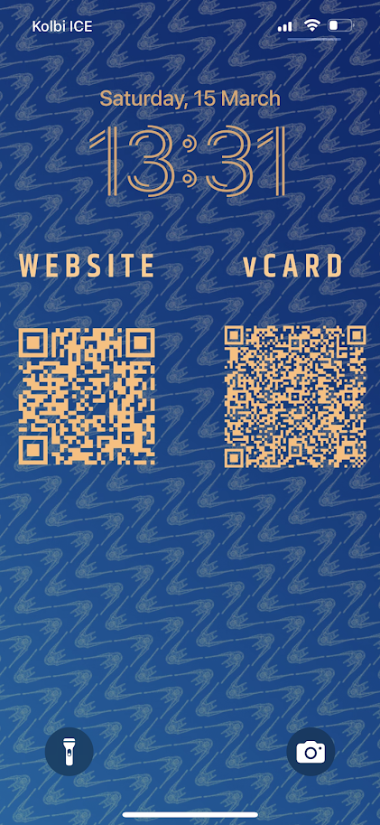

# Create your own virtual business card
Going to a conference and want to share your contact info? Here's an easy way to create a QR code for reading a vCard (virtual business card) object and a website. I wanted to have the QR codes at hand so I updated a version of my phone's wallpaper by adding them in it. This way, I just swap the wallpapers whenever I want to share the information and other people can scan them. I also added the QR codes in my presentation's final slide. You can create a wearable pin, add it to your physical business card or have it printed in a shirt, I don't know. I just use it in my phone. Enjoy!  

## Streamlit App
This project has been reorganized to work as a Streamlit app. You can run `streamlit run 1_🥥_Home.py` in your terminal to launch it in a local environment. 

## Create .vcf file and QR code
The `vcard_generator.py` file will create a .vcf file with your contact information once you replace the template with your actual values. It will also store your .vcf file and create a QR code that can be scanned to save your contact information. 

## Create .png file with the QR code
I used the [python QR Code Generator](https://github.com/lincolnloop/python-qrcode) to create the png files. Running `qr_generator.py` will generate a QR code for your website. 

## Display it quickly!
I added the QR codes as part of my phone wallpaper. iPhones let us quickly switch wallpapers so it turned out to be useful when sharing information during a conference.

